

  

<h1 align="center">新月罗盘</h1>

  面向国服 Dalamud API 15 的新月岛综合辅助插件
   
  将普通宝箱、魔法罐寻宝、FATE、CE、场景提示和导航集中在一处

  <a href="#地图与普通宝箱">地图与宝箱</a> ·
  <a href="#魔法罐寻宝">魔法罐寻宝</a> ·
  <a href="#fate-与-ce">FATE 与 CE</a> ·
  <a href="#事件速查">事件速查</a> ·
  <a href="#导航与显示">导航与显示</a>

## 功能一览

| 功能 | 可以做什么 |
| --- | --- |
| **普通宝箱** | 显示铜／银宝箱固定点位，长期记录已确认存在的宝箱，调查并估算区域剩余数量 |
| **魔法罐寻宝** | 解析方向与距离提示，筛选固定候选点，跟踪寻宝轮次并显示实例预测 |
| **FATE 与 CE** | 查看实时状态、剩余时间、魂晶奖励、触发怪、触发解禁时间和众包信息 |
| **收藏提醒** | 事件刷新时发出游戏内提醒；失焦时可改用 Windows 横幅，并独立控制声音 |
| **场景标注** | 在游戏画面中显示宝箱、候选点、FATE、CE、魔法罐和怪物信息 |
| **地图导航** | 从地图或速查窗口直接前往，支持 vnavmesh、传送、坐骑、脱困和怪物绕行 |

## 地图与普通宝箱

地图汇总当前事件、宝箱、魔法罐候选、玩家和队友位置。探知到的普通宝箱会保存至开启，更换地图也不会清除；静态点位、已确认宝箱和场景标签可以分别开关。

<table>
  <tr>
    <td width="52%" align="center"><strong>地图总览</strong></td>
    <td width="48%" align="center"><strong>宝箱调查与确认状态</strong></td>
  </tr>
  <tr>
    <td align="center">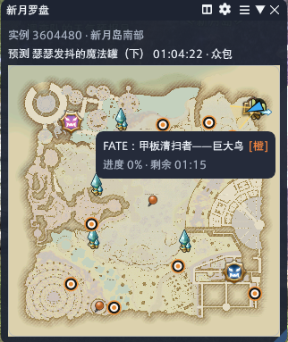</td>
    <td align="center">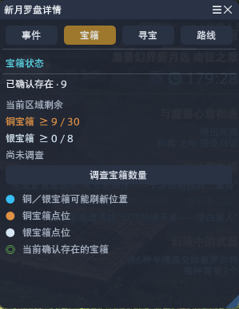</td>
  </tr>
</table>

## 魔法罐寻宝

收到撒娇罐提示后，新月罗盘会用方向和距离逐步缩小范围，在地图上绘制提示边界并列出剩余候选。错误输入可以撤销，也可以切换关注点或重置本轮。

  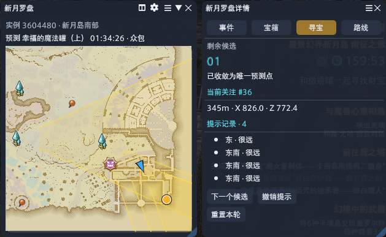

<table>
  <tr>
    <td width="42%" align="center"><strong>场景候选</strong></td>
    <td width="58%" align="center"><strong>魔法罐预测</strong></td>
  </tr>
  <tr>
    <td align="center">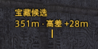</td>
    <td align="center">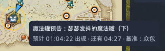</td>
  </tr>
  <tr>
    <td align="center">直接显示候选距离与高差</td>
    <td align="center">显示预计出现时间、剩余时间和数据来源</td>
  </tr>
</table>

## FATE 与 CE

事件页同时呈现 FATE、魔法罐预测和 CE。状态会随报名、准备、战斗和结束过程更新，并用彩色短标签标出魂晶奖励。

<table>
  <tr>
    <td width="48%" align="center"><strong>当前事件</strong></td>
    <td width="52%" align="center"><strong>游戏场景标注</strong></td>
  </tr>
  <tr>
    <td align="center">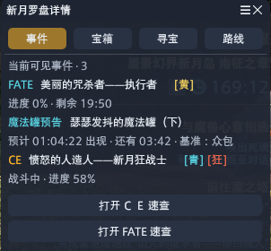</td>
    <td align="center">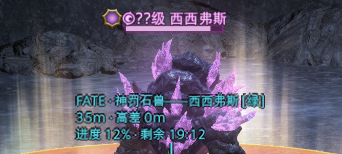</td>
  </tr>
</table>

收藏的事件每次出现只提醒一次。游戏在前台时使用 Dalamud 通知和可选醒目横幅；失焦或最小化时可以显示短暂的 Windows 横幅。

## 事件速查

CE 速查列出触发方式、触发怪、加速触发信息、触发解禁时间、众包状态和已知位置。FATE 速查覆盖南北岛事件。两者都支持搜索、收藏、区域筛选和从已知坐标直接前往。

### CE 关注与触发怪速查

  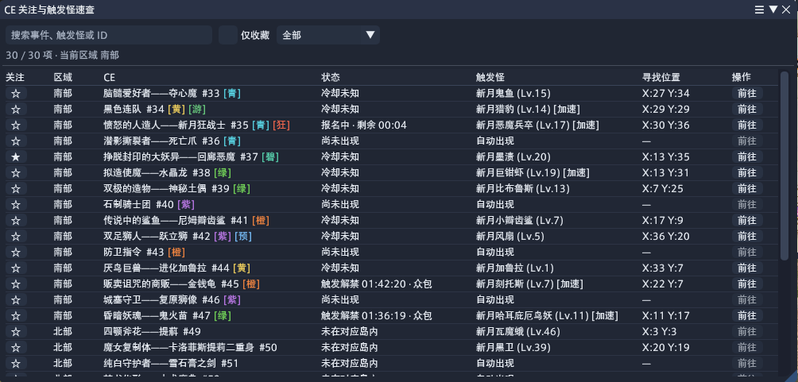

### FATE 关注与位置速查

  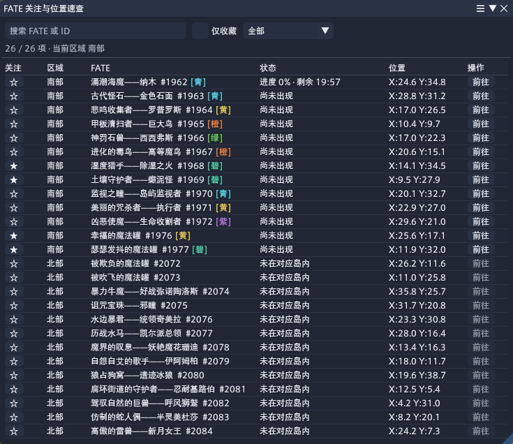

## 导航与显示

导航会比较直达与传送路线，并把最终路径绘制在地图上。启用 vnavmesh 后支持移动中上坐骑、卡住检测、跳跃恢复；北岛还可以按怪物警戒范围调整路线。

<table>
  <tr>
    <td width="44%" align="center"><strong>路线预览</strong></td>
    <td width="56%" align="center"><strong>地图标记尺寸</strong></td>
  </tr>
  <tr>
    <td align="center">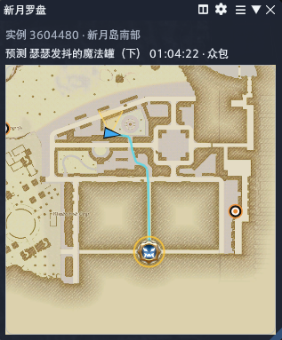</td>
    <td align="center">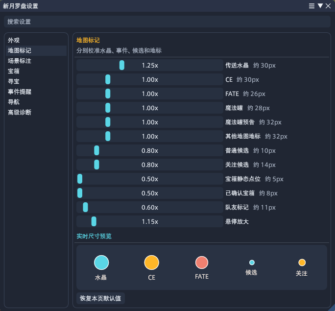</td>
  </tr>
</table>

<strong>使用说明</strong>

- vnavmesh 是可选依赖；未安装时仍可使用地图、宝箱、事件、提醒和场景标注。
- 魔法罐预测只用于寻宝提示，实际刷新前不会触发收藏 FATE 提醒。
- 使用寻宝功能期间会暂时隐藏已刷新普通宝箱的场景标签，减少画面干扰。
- 地图标记、场景标注和提醒均可在“新月罗盘设置”中独立开关或调整。

## 许可

项目使用 AGPL-3.0 许可。第三方实现与数据来源见 [第三方来源说明](../../THIRD_PARTY_NOTICES.md)。
